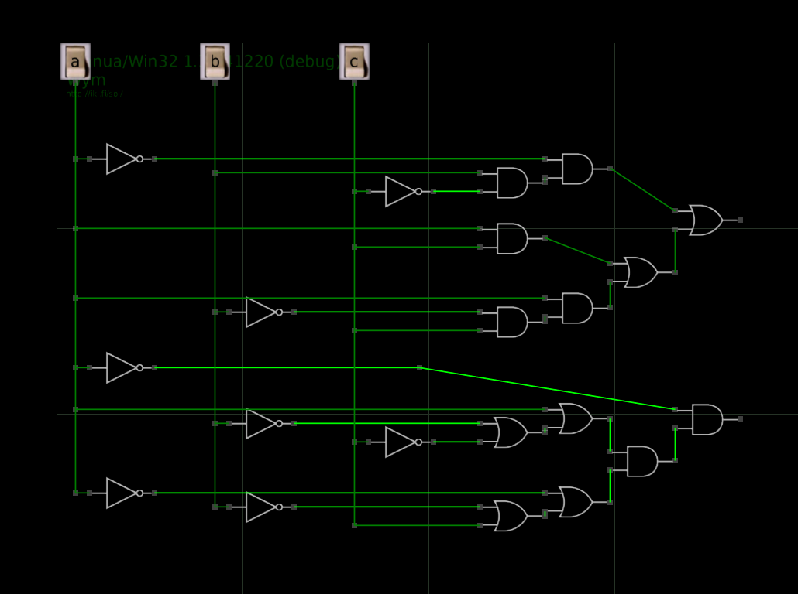

## Satanua
### Setup
```
pip install satanua
```
### Usage
##### Warning! This library is not meant to be used under any circumstances in production code!!!

First, create ObjStack and WireStack. All the objects and wires are stored here and from there can be accessed and deleted from the scene.
```python
from satanua import ObjStack, WireStack
obj_stack = ObjStack()
wire_stack = WireStack()
```
Now, to create a decoder, use
```python
from satanua import Decoder, DecoderModes 

decoder = Decoder(
    obj_stack=obj_stack,
    wire_stack=wire_stack,
    formulas=[
        [
            [0, 1, 0],
            [1, None, 1],
            [1, 0, 1]
        ],
        [
            [0, None, None],
            [1, 0, 0],
            [0, 0, 1]
        ]
    ],
    modes=[
        DecoderModes.AND_OR,
        DecoderModes.OR_AND
    ],
    coordinates = [0, 0]
)
decoder.build()
```
`formulas`+`modes` in this example is the equivalent of

```math
OutVal_1 = \overline{A}B\overline{C}+AC+A\overline{B}C \\\
OutVal_2 = (\overline{A})*(A+\overline{B}+\overline{C})*(\overline{A}+\overline{B}+C)
```


You can then export the whole scene to .atanua using 
```python
from satanua import render_all

render = render_all(
    os=obj_stack,
    ws=wire_stack,
    rotate=0,
    mirror_x=False,
    mirror_y=False
)
with open("render.atanua", "w") as f:
    r.write(render)
```

Render.atanua

